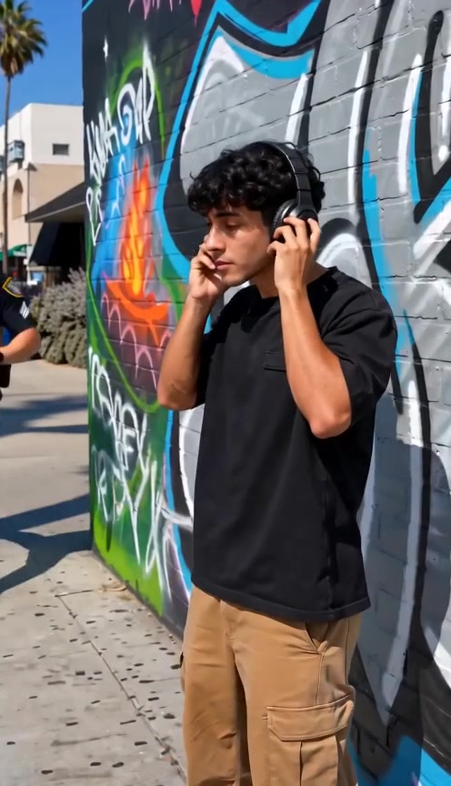
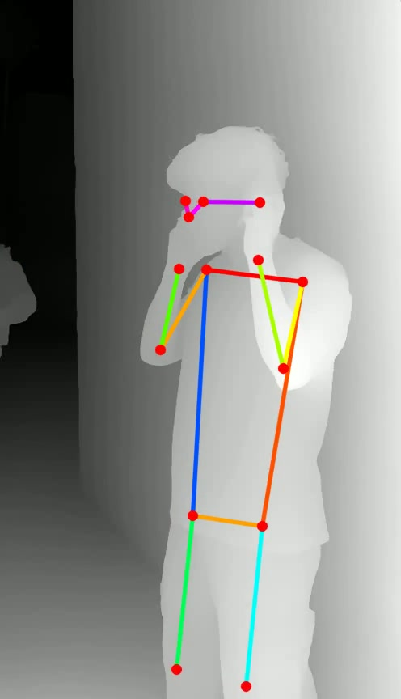

# pose-depth

Convert a video into a **pose skeleton + depth map** video: for every frame it
estimates monocular depth (grayscale, brighter = closer) and overlays
OpenPose-style colored skeletons for the people in frame.

Useful for driving video-generation models (e.g. Seedance) with structural
conditioning, or for motion/staging reference.

| Input | Output |
| --- | --- |
|  |  |

## Setup

```sh
python3 -m venv .venv
.venv/bin/pip install -r requirements.txt
```

The pose model (YOLOv8s-pose, ~23 MB) and the depth model (Depth Anything V2
Small, ~100 MB from Hugging Face) are downloaded automatically on first run.

## Usage

```sh
.venv/bin/python video2posedepth.py input.mp4
```

Writes `input_posedepth.mp4` next to the input. Options:

| Flag | Description |
| --- | --- |
| `-o OUT.mp4` | output path |
| `--layout depth-only\|stacked\|side-by-side` | `depth-only` (default) outputs just the depth+pose video; `stacked`/`side-by-side` composite the original frame with it |
| `--depth-backend image\|video` | `image` (default) runs Depth Anything V2 per frame and streams; `video` runs [Video Depth Anything](https://github.com/DepthAnything/Video-Depth-Anything) for temporally consistent depth (auto-clones the repo + ~116 MB checkpoint on first use, loads the whole clip into memory) |
| `--depth-model ID` | any HF depth-estimation model for the `image` backend (default `depth-anything/Depth-Anything-V2-Small-hf`; use `...-Large-hf` for higher quality) |
| `--no-pose` | depth map only, skip the skeleton |
| `--pose-backend yolo\|mediapipe` | `yolo` (default) is robust for multiple people; `mediapipe` has denser landmarks but only tracks one person reliably |
| `--max-people N` | max number of people to skeleton (default 4) |
| `--max-frames N` | process only the first N frames (quick preview) |

## Notes

- Runs on Apple Silicon GPU (MPS) or CUDA automatically; falls back to CPU.
  ~7–8 fps on an M-series Mac for a 496×864 clip.
- Depth normalization: the `image` backend stretches each frame's range with a
  temporally smoothed min/max (max per-frame contrast, some residual flicker);
  the `video` backend uses one global scale for the whole clip, so brightness
  means the same distance in every frame (~40% less frame-to-frame depth
  change on our test clip).
- DepthCrafter is a diffusion-based alternative with great quality but needs a
  large CUDA GPU and minutes per clip, so it isn't integrated here.
- Skeletons are drawn for up to `--max-people` people (default 4); low-
  confidence detections and joints are skipped automatically.
- Output is H.264/yuv420p, playable everywhere.

## License

[MIT](LICENSE)
